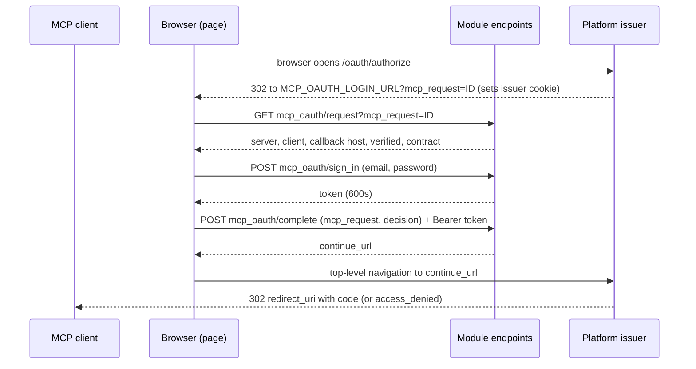
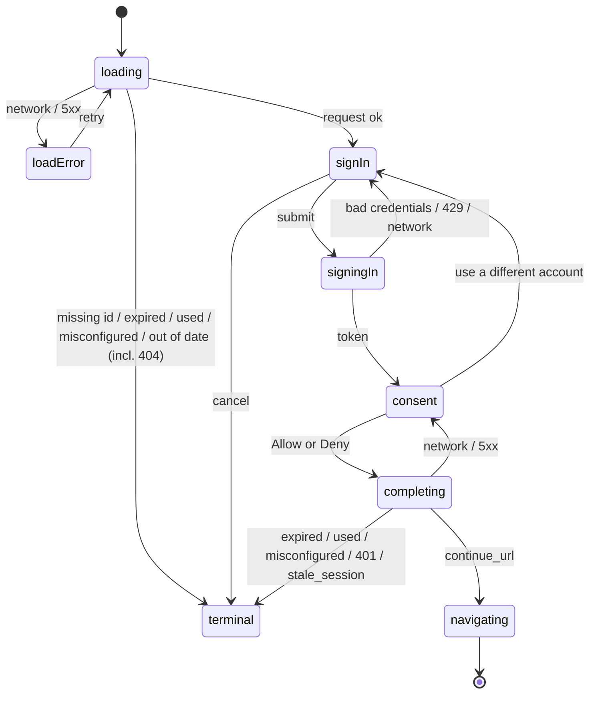
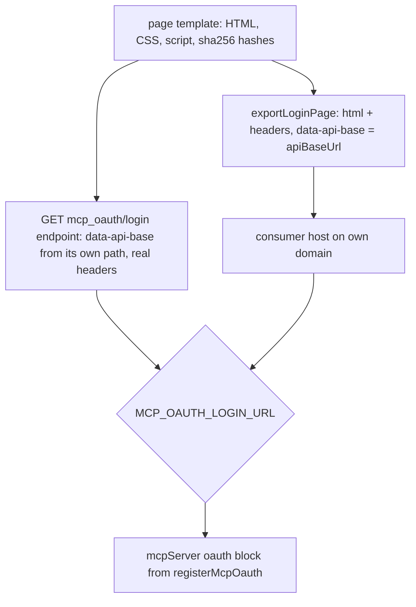

# MCP OAuth Sign-in Module - Plan

**Target repo:** `xano-sdk/mcp-oauth` (this repo). Pattern sources are the sibling module repos `xanots/password-reset` and `xano-sdk/auth`, and the SDK repo `xano-sdk/sdk-dev`; paths into those repos are prefixed `[password-reset]`, `[auth]`, `[sdk]`.

---

## Goal Capsule

- **Objective:** A Xano SDK user can add sign-in to their MCP servers in minutes. They install one marketplace module, register it, and set one environment variable. After that, MCP clients such as Claude can connect, send the user through a branded sign-in and consent page, and act as that user.
- **Means:** A workspace module, `@xano-sdk/mcp-oauth`, contributes the page, the endpoints behind it and a ready `oauth` block for `mcpServer()`. The page is served by the consumer's backend or exported to their own domain (Key Decisions, KTD1–KTD6).
- **Authority:** Product Contract Requirements win on behavior. KTDs win on mechanism within those requirements. Units override neither. The SDK skill `[sdk] .claude/skills/xanosdk-module/SKILL.md` governs module conventions wherever this plan is silent.
- **Execution profile:** Greenfield package. U2 is a live-platform spike and runs before any page or endpoint code is committed to a shape.
- **Stop conditions:**
  - U2 shows that an endpoint cannot serve the page as HTML with the headers intact.
  - U2 shows that hosted MCP OAuth cannot be exercised on an ephemeral and no development instance is available.
  - Implementing anything requires `unsafe_user_id`.
  - Stop and report in each case rather than working around it.
- **Who finishes:** `ce-work` implements U1–U8. U9 (npm publish, GitHub release, marketplace seed) needs the user's go-ahead, because each step is outward-facing.

---

## Product Contract

### Summary

Build `@xano-sdk/mcp-oauth`, a workspace module for hosted-mode MCP OAuth. `registerMcpOauth(app, { authTable })` adds a sign-in and consent page plus three JSON endpoints, and returns the `oauth` block the consumer passes to `mcpServer()`. The same page can also be exported as a file for the consumer's own domain. Hosted mode only, email and password only.

### Problem Frame

The SDK already supports hosted OAuth on an MCP server: `mcpServer({ oauth: { mode: "hosted", authTable, loginUrl } })` (`[sdk] src/kinds/mcp-oauth.ts`). The platform runs the authorization server and redirects the user's browser to `loginUrl?mcp_request=<id>`. Everything behind that URL is left to the consumer.

That page has a hard contract. It must:
- read the pending request with `s.mcp.oauth.request`
- show who is asking
- sign the user in against the server's auth table
- call `s.mcp.oauth.complete` with a session token under ten minutes old
- send the browser to a single-use continue URL in the same browser
- do all of it within ten minutes of the client's authorize call

Getting any part wrong fails quietly or insecurely, and nothing in the SDK shows how it is done. In practice, MCP sign-in is out of reach for the people the SDK targets, and this module is meant to put it within reach.

### Key Decisions

- **The page ships in two delivery modes from one template.** The consumer's backend serves the page for quick setup and development. The same page exports as a file for hosting on the consumer's own domain in production. The page shows a notice when it runs on a shared instance domain. (session-settled: user-directed — chosen over endpoint-only and self-hosted-only: quick setup by default, plus a production path off the shared instance domain.) Governs R6, R11.
- **Hosted mode only, email and password only.** External-provider mode already has its provider's pages. Social login, magic links and MFA are out. (session-settled: user-approved — scoping confirmation; chosen over covering external mode and other sign-in methods.) Governs R8.
- **Branding by options, not template override.** Product name, accent color and logo are options. A whole custom template is out. (session-settled: user-approved — scoping confirmation.) Governs R10.

### Requirements

**Setup and wiring**

- R1. Installing the module, calling `registerMcpOauth(app, { authTable })` and setting one environment variable gives working hosted sign-in to every MCP server that uses that auth table.
- R2. The register call returns an `oauth` block that drops straight into `mcpServer({ oauth })`. The consumer never hand-builds the hosted block.
- R3. It works with `@xano-sdk/auth`'s `userTable` and with any consumer auth table, with the email and password column names configurable.
- R4. `xanosdk init --marketplace @xano-sdk/mcp-oauth` writes the registration into `xano/index.ts` when `@xano-sdk/auth` is also chosen.
- R5. The endpoint-served page's URL follows from the instance host plus the group canonical, and the canonical is known before the first deploy. On an ephemeral, the host exists only after its first deploy, so the Quickstart sets the variable right after that deploy.

**The page**

- R6. One page template, two delivery modes:
  - served by the module's own endpoint
  - exported as an HTML document plus the response headers it needs, for hosting elsewhere

  Which mode is live is decided only by where the login URL points.
- R7. The page always shows:
  - the MCP server's name
  - the client's name
  - where the browser will be sent afterwards (the callback host)
  - whether the client is verified

  An unverified client carries a persistent warning, and its logo is never shown.
- R8. The user signs in with email and password, then chooses Allow or Deny. Either choice lands back on the MCP client.
- R9. Every way the flow can fail shows a plain-language state that tells the user whether retrying on this page can help (the table under Acceptance Examples).
- R10. The consumer can set a product name, an accent color and a logo. They are baked into the page.
- R11. When the page runs on a shared Xano instance domain, it shows a small developer-facing notice. A consumer option turns the notice off.

**Security**

- R12. The module never uses `unsafe_user_id`. The token minted at sign-in lives at most 600 seconds, is held in page memory only, and is used only to complete the request.
- R13. An unknown email and a wrong password get the same error. Sign-in is rate limited by default. A consumer can name a boolean column, for example `active`, that must be true for a user to sign in.
- R14. Request history is off by default on every module endpoint, because they carry passwords and bearer tokens.
- R15. In both modes the page cannot be framed, runs under a restrictive CSP, and can never send a credential in a URL.

**Packaging**

- R16. The package follows the sibling-module conventions:
  - version 1.0.0 and the 1.0.x policy in `AGENTS.md`
  - peer `@xano/sdk >=1.0.0 <2.0.0`, with the dev pin exact
  - the README / llms.txt / AGENTS.md trio
  - a marketplace listing
  - the Slack release alert, already copied in `.github/`

### Acceptance Examples

How the page handles each outcome (R9). A stale token may be refused by the endpoint's auth block (401) before `complete` runs, or by `complete` itself (`stale_session`). The page treats both the same.

| Signal | Where it arises | Page state |
|---|---|---|
| `mcp_request` missing from the URL | page load | Terminal "This sign-in link is incomplete". No API call. |
| 404 from `request` | page load | Terminal "This sign-in page is out of date" (KTD7). |
| Network error or 5xx | page load | Error with a retry control that re-runs the load check. |
| Cancel pressed before sign-in | first screen | Terminal "You can close this tab". No API call. |
| 400 `request_expired` or `request_used` | `request` or `complete` | Terminal "This link expired or was already used. Return to your app and connect again." |
| 400 `wrong_tenant`, `wrong_server`, `wrong_table` or `datasource_mismatch` | `request` or `complete` | Terminal "This sign-in page is misconfigured", with the code shown so a report reaches the developer. |
| Contract mismatch (exported page older than the deployed endpoints) | `request` on load | Terminal "This sign-in page is out of date", before any credential is typed. |
| Generic credential error | `sign_in` | Inline error. Email kept, password cleared. |
| 429 | `sign_in` | Inline "Too many attempts, try again shortly". |
| 401, or 400 `stale_session` | `complete` | Terminal expired copy, as for `request_expired`. A token old enough to fail means the request's own ten-minute window has closed, so signing in again cannot help. |
| Network error or 5xx | `sign_in` or `complete` | Retry control on the same screen. The request is not consumed. |
| Approve or Deny succeeds | `complete` | "Returning you to <callback host>…", then immediate navigation. Responses arriving later are ignored. |

### Success Criteria

- A real MCP client, such as Claude or MCP Inspector, connects to a server on a deployed ephemeral, completes sign-in through the endpoint-served page, and calls a tool whose `auth()` resolves to the signed-in row.
- The same flow passes with the exported page served from a different origin.
- A developer new to the module gets from `npm install` to a first successful connection by following only the README Quickstart.

### Scope Boundaries

- External-provider mode, social login, magic links and MFA.
- A custom page template beyond the branding options.
- More than one module instance per workspace, meaning more than one auth table, in 1.0.x. One instance serves every MCP server on that auth table.
- Sign-up and password reset on the page. The page tells a user with no account to contact the app owner.
- Changes to the SDK core.

Considered and not built:
- **Honoring the consumer's MFA or other login logic** beyond one boolean column (R13). The README states plainly how far the sign-in token reaches. A consumer request would change the call.
- **Rate limits on `request` and `complete`.** `request` reads an unguessable, single-use id. `complete` already requires a session and consumes the request. Sign-in is the brute-force surface. Abuse evidence would change the call.
- **A way to switch off the endpoint-served route in production.** It is harmless: it serves the same consent flow. Evidence of confusion would change the call.
- **A client-side countdown for the ten-minute window.** The on-load `request` check already catches expired links, and the remaining edge is documented.

#### Deferred to Follow-Up Work

- **Tenant selection in an exported page**, for example through a `?tenant=` query. In 1.0.x each tenant gets its own export, with the tenant path in its API base URL.
- **Optional `signUpUrl` and `forgotPasswordUrl` links.**
- **A real Cancel before sign-in.** This needs the platform to expose the cancel URL to a statement, which the SDK does not have today. Raise it with the platform team.

---

## Planning Contract

### Key Technical Decisions

- KTD1. **Two requests, never `unsafe_user_id`.**
  - `sign_in` mints a token.
  - The page then calls `complete` with that token as a bearer, on an endpoint whose `auth` is the consumer's auth table.

  Minting a token does not authenticate the request it was minted in, so one request cannot do both without `unsafe_user_id`. That flag skips the platform's table and session checks and marks the grant `unsafe`. The platform trace confirms the endpoint's `auth` table must equal the server's `oauth.authTable`, which is why one `authTable` option feeds both. Governs R12.
- KTD2. **The page is static at build time.** All runtime data goes into the page through `textContent`, never interpolated as HTML. The CSP authorizes the inline script and style by sha256 hash.
  - The template (HTML, CSS, one inline script) is assembled in TypeScript at build time, like `[password-reset] src/api/email-template.ts`.
  - Brand strings are HTML-escaped and the accent color is validated as hex.
  - `client_name` and the other client-controlled values arrive at runtime from `request` and are rendered with `textContent`, so a hostile client name cannot inject markup.
  - Per-mode data (API base, contract version, notice flag) lives in `data-` attributes, not in the script, so the script's hash is the same in both modes and pinned by the golden test.
- KTD3. **The API group pins a default canonical, `mcp-oauth-<workspace name>`, which the consumer can override.**
  - The workspace name is read from the app passed to `registerMcpOauth` and slugged to the canonical grammar.
  - The pin makes the endpoint-served URL `https://<instance host>/api:<canonical>/mcp_oauth/login`, so the canonical is known before deploy (R5). The `login` query's `getPath()` gives the path, so nobody builds it by hand.
  - This deviates from the sibling rule "no canonical by default" (`[sdk] .claude/skills/xanosdk-module/SKILL.md` §3). The login URL lives in an env value, and with no pin the canonical could change under it.
  - An API group canonical is unique per instance, across every workspace (`[sdk] src/deploy/xanosdk-import.ts`, `CanonicalOutcome`). That is why a bare `mcp-oauth` is not the default.
    - A pinned slug that another workspace already owns refuses the import with `conflict`.
    - On the legacy import route it silently mints a random token instead.
    - The workspace-name suffix makes a collision unlikely, and the override is the fix when one happens.
    - U7 checks that the canonical is `honored` before the env value is set.
- KTD4. **`loginUrl` defaults to `env("MCP_OAUTH_LOGIN_URL")`.** Pointing that variable at the module's endpoint, or at the consumer's exported page, is the whole mode switch (R6). A consumer can pass a literal URL string instead.
  - Each environment, and each tenant, sets its own value.
  - Changing it signs nobody out, because the platform excludes `login_url` from the server config hash.
- KTD5. **Consent takes two steps.**
  - **First screen:** consent details plus the sign-in form.
  - **Second screen:** "Signed in as <email>" above the full R7 block, including any unverified warning, then Allow and Deny, plus "Use a different account".

  The platform gives a statement no cancel URL, so Deny can reach the client only after sign-in. Before sign-in, "Cancel" says the tab can be closed. Allow is never pre-focused for an unverified client.
- KTD6. **The export function returns `{ html, headers }`.**
  - `headers` is the exact set the host must send: CSP including `frame-ancestors 'none'`, `X-Frame-Options: DENY`, `Referrer-Policy: no-referrer`, `Cache-Control: no-store`.
  - The HTML also carries a meta CSP for every directive meta supports, `<meta name="referrer">`, and a frame-buster that hides the form when `top !== self`. A host that cannot set headers still gets framing protection.
  - `connect-src` names the API base origin in exported mode and is `'self'` when the page is endpoint-served.
  - `img-src` lists the `brandLogoUrl` origin exactly, when that option is set, plus `https:` for a verified client's logo. The platform has already sanitized that logo to a plain https URL. There is no wildcard and no `data:`. Every `` carries `referrerpolicy="no-referrer"`.
  - The export takes `apiBaseUrl`, which includes any `/tenant/<name>` path, plus the same branding options. It produces the identical script.
- KTD7. **A contract version travels in the `request` response.** The page checks it on load. An exported page frozen at an older wire contract stops before credentials are typed (Acceptance Examples). The contract is bumped only when routes, inputs or response shapes change. Such a release's notes say "re-export required". The `mcp_oauth/request` route and its `contract` field are themselves frozen for 1.x, because they carry the check. A 404 from `request` reads as out of date.
- KTD8. **Rate limiting reuses the password-reset helper** (`[password-reset] src/api/rate-limit.ts`, one statement, `disabled: true` when turned off).
  - **Buckets:** only `sign_in` is limited, per IP and per normalized email. The other endpoints are under "Considered and not built".
  - **Settings:** a default of five attempts. The per-email window is no longer than the ten-minute flow, so failing on purpose against someone's email locks them out of one sign-in, not several. Overridable, or `false`.
  - The 429 behavior is already verified live in `[password-reset] AGENTS.md`.
- KTD9. **The manifest declares options in the chatbot form:** `options: { authTable: { package: "@xano-sdk/auth", export: "userTable" } }`, with `returns: "handle"`. Every other option is optional (KTD3, KTD4), so the CLI can write the call itself (R4).
  - The manifest cannot write the consumer's `mcpServer({ oauth: mcpOauth.oauth })` line, so the catalogue `register_snippet` and agent prompt carry it.
- KTD10. **Factories plus a `WeakSet<Xano>` guard, following password-reset:** `createMcpOauth(options)` builds and `registerMcpOauth(app, options)` builds, registers and returns the defs. Every def references the consumer's auth table, so module-level singletons are ruled out (`[sdk] .claude/skills/xanosdk-module/SKILL.md` §1). The guard enforces one instance per workspace (Scope Boundaries).
- KTD11. **Sign-in is a copy of `[auth] src/api/login.ts`, pointed at the consumer's table:**
  - password as `input.text`
  - `output` naming the password column
  - a `{ safe: true }` null guard
  - when `activeColumn` is set, a precondition that the column is true (R13)
  - identical `accessdenied` messages for an unknown email, a wrong password and an inactive user
  - `expiration` 600 seconds, so the token cannot outlive the window `complete` accepts

  Request history is off at the group (R14).

### High-Level Technical Design

**The sign-in sequence** (both modes; only the page's origin differs):



**The page's states.** Controls are disabled while a request is in flight. Once navigating, every later response is ignored.



**How the two modes are wired:**



When the page is endpoint-served, it derives its API base by stripping the trailing `/mcp_oauth/login` from its own `location.pathname`. Any `/tenant/<name>/` prefix stays intact, so tenants work without parsing.

### Output Structure

```
package.json  tsconfig.json  tsup.config.ts  vitest.config.ts  eslint.config.js  .gitignore  LICENSE
README.md  llms.txt  AGENTS.md  GEMINI.md  .cursor/rules/xanosdk-module.mdc
.github/copilot-instructions.md  .github/workflows/ci.yml
.github/workflows/release-slack.yml  .github/RELEASE_TEMPLATE.md  .github/scripts/*   (present)
scripts/regen-golden.ts
src/index.ts  src/register.ts  src/options.ts  src/contract.ts
src/api/group.ts  src/api/rate-limit.ts  src/api/request.ts  src/api/sign-in.ts
src/api/complete.ts  src/api/login-page.ts  src/api/client-types.ts
src/page/template.ts  src/page/script.ts  src/page/styles.ts  src/page/csp.ts  src/page/export.ts
test/setup.ts  test/helpers.ts  test/golden.ts  test/fixtures/golden-bundle.json
test/bundle.test.ts  test/options.test.ts  test/queries.test.ts  test/register.test.ts
test/manifest.test.ts  test/types.test.ts  test/published-docs.test.ts
test/page-template.test.ts  test/page-script.test.ts  test/export.test.ts
local-files/probe/   (gitignored live probes)
```

### Implementation Constraints

- Every SDK constant is a `c.*` value. Every stack stays a literal tuple, with `statements(...)` for helpers, never a spread `Statement[]`. A widened stack shows up only in a consumer's typecheck, so `test/types.test.ts` asserts against it.
- Every option is validated in `src/options.ts` before any def is built. Errors are prefixed `registerMcpOauth:` in the password-reset style.
- No platform source names, repo names or internal class names appear in shipped docs (`[sdk] AGENTS.md`).
- Every endpoint sets request history off. The page script never writes the token or password to storage.

### Risks & Dependencies

| Risk | Mitigation |
|---|---|
| Endpoint-served HTML is untested in the SDK: the engine path is traced, not run. | U2 proves it live before U4–U6 commit to it. A failure is a stop condition. |
| Hosted MCP OAuth may not work on an ephemeral. | U2 checks first. The fallback is a development instance. |
| On a shared `*.xano.io` instance domain, the page shares an origin with every other workspace on that instance. Their scripts could read what users type. | Accepted by the user for endpoint-served mode. Production runs on the consumer's domain through the exported page (Key Decisions). R11's notice and the README say so plainly. |
| On the first promote, the env value can carry over from the source environment and point at the wrong instance. | README: set production's `MCP_OAUTH_LOGIN_URL` at the first promote, then verify it with a real connection. |
| The marketplace repo is not on disk, so the catalogue seed format is unverified. | U9 depends on access to it. The listing fields come from `[sdk] .claude/skills/xanosdk-module/references/marketplace-listing.md`. |
| An exported page goes stale after a host, canonical, branding or contract change. | KTD7 catches contract drift. The README lists when to re-export. |

### Sources & Research

- Platform behavior of `request`/`complete`, lifetimes, refusal codes, cookie binding and HTML passthrough: the internal trace `/tmp/compound-engineering-501/ce-plan-research/125edc44/platform-trace.md`, summarized into the KTDs above. That trace cites platform source, which must not reach shipped docs.
- Module conventions: `[sdk] .claude/skills/xanosdk-module/SKILL.md` and its `references/` (scaffold, docs contract, release, marketplace listing).
- Closest analogue: `[password-reset] src/options.ts`, `src/register.ts`, `src/api/rate-limit.ts`, `src/api/email-template.ts`, `test/`.
- Sign-in stack: `[auth] src/api/login.ts`.
- SDK surface: `[sdk] src/kinds/mcp-oauth.ts`, `src/workspace/guards-mcp-oauth.ts`, `src/statements/respond.ts`, `llms/kinds-agent-mcp.md`.
- Consent screen requirements: the MCP security best-practices guidance (show the client name and redirect host, CSRF protection, block framing) and OAuth 2.0 Security BCP (RFC 9700). The RFC section numbers were not re-verified.
- Learnings:
  - `[sdk] docs/solutions/` on static hosts being torn down on every ephemeral redeploy
  - proving response fields on the wire, not only in golden bundles
  - the `db.get` safe-ref trap

---

## Implementation Units

### U1. Scaffold the package

- **Goal:** An empty, publishable module skeleton that builds, lints and tests green, matching the sibling layout.
- **Requirements:** R16
- **Dependencies:** none
- **Files:**
  - `package.json`, `tsconfig.json`, `tsup.config.ts`, `vitest.config.ts`, `eslint.config.js`, `.gitignore`, `LICENSE`
  - `.github/workflows/ci.yml`, `GEMINI.md`, `.cursor/rules/xanosdk-module.mdc`, `.github/copilot-instructions.md`
  - `src/index.ts`, `test/setup.ts`
- **Approach:**
  1. Copy the config files verbatim from `[password-reset]`. Set `name: @xano-sdk/mcp-oauth`, version `1.0.0`, peer `@xano/sdk >=1.0.0 <2.0.0`, dev pin `1.0.0` exact, `engines.node >=20`, and the repository, homepage and bugs URLs for `xano-sdk/mcp-oauth`.
  2. Add the `"xanosdk"` manifest block per KTD9.
  3. Copy `ci.yml` and the three pointer files from `[password-reset]`. Each pointer file only points at `AGENTS.md`.
  4. Leave the existing `.github/` Slack files and `AGENTS.md` sections in place. Later units extend `AGENTS.md`.
- **Patterns to follow:** `[password-reset]` root files. `[sdk] .claude/skills/xanosdk-module/references/scaffold.md`.
- **Test expectation:** none — scaffolding. `npm run typecheck`, `npm run lint` and `npm test` run green on an empty surface, and `npm pack --dry-run` lists only the intended files.
- **Verification:** CI's verify job passes on the first push.

### U2. Probe the platform live before committing to the page shape

- **Goal:** Settle on a real backend the behavior the design rests on, and record it.
- **Requirements:** R6, R9, R12, R15
- **Dependencies:** U1
- **Files:** `local-files/probe/index.ts` (gitignored). Dated findings go into `AGENTS.md`.
- **Approach:** Deploy a throwaway workspace to an ephemeral with:
  - a seeded auth-table user
  - an MCP server in hosted mode
  - a GET endpoint that sets `Content-Type: text/html` plus CSP, `Referrer-Policy` and `Cache-Control` headers, and returns page-like HTML
    - its inline `<script>` and `<style>` contain non-ASCII characters, both newline styles, backslashes, quotes, `<` and a `${...}` sequence
    - its CSP is built from their locally computed sha256 hashes

  Confirm each of these:
  1. In a real browser, that script runs with no CSP violation, so the engine returned the bytes exactly as hashed.
  2. `?mcp_request=` binds to a GET input.
  3. Hosted authorize runs on an ephemeral.
  4. A stale token on `complete` answers 401 or 400 `stale_session`. Record which. The page treats both as expired (Acceptance Examples).
  5. A `db.get` on an unknown email, and on a row with a null password hash, fails with the generic error.
  6. A cross-origin preflight carrying `Authorization` passes under the group's default CORS. If it does not, U3 adds an `allowedOrigins` option and U4 sets the group's CORS from it, before the exported mode is built.

  The 429 behavior is already recorded in `[password-reset] AGENTS.md`, so it is not probed again.
- **Execution note:** Spike first. Do not write U4–U6 until items 1–3 hold. If item 1 or 3 fails, stop (Goal Capsule).
- **Patterns to follow:** `[password-reset] local-files/probe/index.ts` (import `@xano/sdk`, not the stale `@xanots/sdk`), and its `AGENTS.md` "Facts verified against a live instance" section.
- **Test expectation:** none — a probe, not shipped code. Its findings become assertions in U4–U7.
- **Verification:** `AGENTS.md` carries a dated findings list naming the SDK version for each item, and every KTD that depends on an item still holds.

### U3. Options gate

- **Goal:** One function validates every option and applies its default before any def is built.
- **Requirements:** R3, R5, R10, R11, R13, R14
- **Dependencies:** U1
- **Files:** `src/options.ts`, `test/options.test.ts`
- **Approach:**
  - The options are:
    - `authTable` (required)
    - `emailColumn` (default `email`), `passwordColumn` (default `password`)
    - `activeColumn` (optional, a boolean column, R13)
    - `loginUrl` (default per KTD4)
    - `canonical` (default per KTD3: `mcp-oauth-` plus the app's slugged workspace name)
    - `brandName`, `brandColor` (hex, default `#18181b`), `brandLogoUrl` (https only)
    - `sharedDomainNotice` (default `true`)
    - `rateLimit` (per KTD8, or `false`)
    - `history` (default `false`)
  - Check that the email and password columns exist on the auth table, that the password column is `f.password()`, and that `activeColumn`, when set, is a boolean column.
  - Check for `created_at`, which the platform's row check needs. It is a system column the SDK injects, so it counts as present unless the table sets `system: false` and declares none.
  - Export `DEFAULT_RATE_LIMIT`.
- **Patterns to follow:** `[password-reset] src/options.ts`: `fail()`, `CANONICAL_PATTERN`, `HEX_COLOR_PATTERN`, `isRuntimeValue`, `columnNamesOf`/`columnTypeOf`.
- **Test scenarios:**
  - Only `authTable` passed: every default is applied, and `loginUrl` is the env reference.
  - A missing `authTable` is refused, naming the option.
  - `emailColumn` naming a column the table lacks is refused. Two bad columns are reported together.
  - A password column that is not `f.password()` is refused.
  - `@xano-sdk/auth`'s `userTable` is accepted, with no `created_at` declared in its schema.
  - A `system: false` table that declares no `created_at` is refused, with the reason (the platform needs it).
  - An `activeColumn` naming a missing or non-boolean column is refused.
  - With no canonical passed, a workspace named "My App" yields `mcp-oauth-my-app`.
  - `brandColor: "red"` is refused as not hex. `#abc` and `#aabbcc` are accepted.
  - `brandLogoUrl` with `http:`, `javascript:` or `data:` is refused. `https:` is accepted.
  - `canonical: "has space"` is refused. A valid custom canonical is kept.
  - `loginUrl` as a non-URL string is refused. An `https:` string and an `env("X")` value are accepted.
  - `rateLimit: { max: 0 }` is refused. `false` is accepted.
  - `history: "yes"` is refused.
- **Verification:** Every option the README documents has an accepting test and, where it validates, a refusing one.

### U4. The JSON endpoints

- **Goal:** `request`, `sign_in` and `complete` behave exactly as the page needs, with security defaults on.
- **Requirements:** R7, R8, R9, R12, R13, R14
- **Dependencies:** U2, U3
- **Files:**
  - `src/contract.ts`
  - `src/api/group.ts`, `src/api/rate-limit.ts`, `src/api/request.ts`, `src/api/sign-in.ts`, `src/api/complete.ts`, `src/api/client-types.ts`
  - `test/queries.test.ts`
- **Approach:**
  - **The group:** pinned canonical per KTD3, history off per R14.
  - **`GET mcp_oauth/request`:**
    - public, no rate limit (KTD8)
    - wraps `s.mcp.oauth.request`
    - adds `contract` from `src/contract.ts` (KTD7)
    - blanks `client_logo` unless `client_verified` (R7)
  - **`POST mcp_oauth/sign_in`:** per KTD11, rate limited per IP and per email (KTD8).
  - **`POST mcp_oauth/complete`:**
    - `auth: authTable`
    - inputs `mcp_request` and `decision` (`approve` | `deny`)
    - wraps `s.mcp.oauth.complete` without `unsafe_user_id` (KTD1)
    - returns the continue URL
  - Platform refusals pass through unchanged, so the page can branch on their messages (Acceptance Examples).
  - Each query is a factory taking the group and the resolved options.
- **Patterns to follow:** `[password-reset] src/api/*.ts` for the factory shape and `rate-limit.ts`. `[auth] src/api/login.ts` for sign-in. `[sdk] examples/sandbox/statements/mcp/oauth/` for the statements.
- **Test scenarios:**
  - `request` emits one `mvp:mcp_oauth_request` reading the `mcp_request` input, and its response carries `contract`.
  - `request`'s response blanks the client logo when `client_verified` is false.
  - `sign_in` reads the configured email column and requests the password column in `output`.
  - `sign_in` mints a token with `expiration` 600 against the consumer's auth table.
  - `sign_in` answers an unknown email and a wrong password with the same `accessdenied` message.
  - With `activeColumn` set, `sign_in` carries a precondition on that column, with the same message. Without it, there is no such step.
  - `sign_in` carries exactly two limiter statements, one keyed per IP and one per normalized email. `request` and `complete` carry none.
  - `complete` declares `auth` as the consumer's auth table, and its `mvp:mcp_oauth_complete` carries no `unsafe_user_id` input in any option combination.
  - `complete`'s `decision` input accepts only `approve` and `deny`.
  - With `rateLimit: false`, every limiter statement is present with `disabled: true`, and none is removed.
  - Every endpoint inherits history off. With `history: true`, every endpoint has history on.
  - With a custom `canonical`, the group carries it.
- **Verification:** The query tests pass, and the U2 probe's live checks for these routes are recorded as passing in `AGENTS.md`.

### U5. The page template and its exported form

- **Goal:** One page that runs the consent flow in both modes, safely.
- **Requirements:** R6, R7, R8, R9, R10, R11, R12, R15
- **Dependencies:** U2, U3. The routes and response shapes come from U4.
- **Files:**
  - `src/page/template.ts`, `src/page/script.ts`, `src/page/styles.ts`, `src/page/csp.ts`, `src/page/export.ts`
  - `test/page-template.test.ts`, `test/page-script.test.ts`, `test/export.test.ts`
- **Approach:**
  - **Rendering:** assembled at build time per KTD2. Brand strings are HTML-escaped, and dark mode is a CSS override only.
  - **Script:**
    - runs the state machine in the High-Level Technical Design
    - reads `mcp_request` from `location.search`
    - reads its API base and contract from `data-` attributes
    - renders runtime values with `textContent`, stripping control and bidi characters and capping their length
    - handles the empty edge values: an empty `callback_host` reads "an app on this device", and an empty `client_name` reads "an unnamed application"
  - **Form:**
    - `method="post"`, and CSP `form-action 'none'`, so the browser never submits the form natively
    - `<noscript>`: "JavaScript is required to sign in"
    - `autocomplete="username"` / `current-password`, real labels
    - submission handled on the form's `submit` event
  - **Accessibility and layout:**
    - error and status regions use `aria-live`
    - focus moves to each new state's heading, or to the email field after a credential error
    - on the consent screen, focus starts on Deny for an unverified client and on Allow for a verified one
    - a viewport meta tag, a single-column card, and touch targets of at least 44px
  - **Token:** held only in a local variable and dropped on "Use a different account" and on bfcache restore (`pageshow` with `persisted`).
  - **Before navigating**, the continue URL must parse as `https:`, or `http://localhost` on development. The script never rewrites it.
  - **Shared-domain notice:** shown when the hostname ends in `.xano.io`, worded for the developer, not as an alarm, and switched off by `sharedDomainNotice: false` (R11).
  - **`src/page/csp.ts`:** computes the script and style hashes and builds both modes' CSP (KTD6).
  - **`src/page/export.ts`:** exposes `exportLoginPage({ apiBaseUrl, ...branding })` returning `{ html, headers }` (KTD6). `apiBaseUrl` must be `https:` and, after normalization, end without a trailing slash.
  - **Test environment:** the script tests need a DOM, which means adding a new dev dependency (`happy-dom`, used per file through vitest's environment comment). Every other test keeps the node environment.
- **Technical design:** directional only. The template is a pure function from resolved options plus mode data to a string. One shared script constant serves both modes, so the hashes are mode-independent.
- **Patterns to follow:** `[password-reset] src/api/email-template.ts` and its test: escape `&` first, complete document, brand block omitted when unset.
- **Test scenarios:**
  - A brand name containing `<script>` and `&` renders escaped, and `&` is escaped first.
  - With no `brandName`, the brand block is absent rather than empty.
  - The CSP's script hash equals the sha256 of the inline script exactly as emitted, and likewise for the style.
  - The endpoint-mode CSP has `connect-src 'self'`. The exported CSP's `connect-src` is exactly the `apiBaseUrl` origin.
  - Both modes' CSP carries `form-action 'none'`, `base-uri 'none'` and `default-src 'none'`. The header set carries `frame-ancestors 'none'` and `X-Frame-Options: DENY`.
  - `img-src` is exactly the brand logo origin plus `https:`, with no wildcard and no `data:`. With no `brandLogoUrl`, it is `https:` alone.
  - The form has `method="post"`, and no input is named in a way that could serialize into the page URL.
  - `exportLoginPage` with an `http:` base URL is refused. A base ending in `/tenant/acme` keeps that path in the data attribute.
  - The script is byte-identical between an endpoint render and an export with different branding and base URL.
  - Script state machine, run in a DOM test environment against a stubbed fetch:
    - Missing `mcp_request`: the terminal state, with no fetch made.
    - Contract mismatch on load: the terminal "out of date" state, with the form never shown.
    - `request_used` on load: the terminal expired/used copy.
    - Bad credentials: an inline error, the email kept, the password cleared.
    - A 401 or `stale_session` from complete: the terminal expired state, and the token is dropped.
    - A 404 from `request` on load: the terminal "out of date" state.
    - A network error on load: the retry control, and retrying re-runs the load check.
    - Cancel before sign-in: the "close this tab" state, with no fetch made.
    - Each state change moves focus to the new heading, and an inline error is announced through the live region.
    - A double click on Allow sends exactly one complete. A response arriving after navigation starts changes nothing on screen.
    - An unverified client: the warning is shown, no logo is rendered, and Allow is not focused.
    - A continue URL with a `javascript:` scheme is refused, with no navigation.
    - A `.xano.io` hostname shows the notice. Another hostname, or `sharedDomainNotice: false`, does not.
  - Framed (`top !== self`): the form is hidden.
- **Verification:** All page tests pass. U7 confirms that a real browser renders and completes the flow in both modes.

### U6. Serve the page, register the module, wire the manifest

- **Goal:** `registerMcpOauth` adds everything and returns defs plus the `oauth` block. The CLI can write the call.
- **Requirements:** R1, R2, R3, R4, R6, R16
- **Dependencies:** U4, U5
- **Files:**
  - `src/api/login-page.ts`, `src/register.ts`, `src/index.ts`
  - `scripts/regen-golden.ts`
  - `test/register.test.ts`, `test/manifest.test.ts`, `test/types.test.ts`, `test/bundle.test.ts`, `test/golden.ts`, `test/helpers.ts`, `test/fixtures/golden-bundle.json`
- **Approach:**
  - **`GET mcp_oauth/login`:**
    - sets the HTML content type and the endpoint-mode header set through `respond.header`
    - returns the rendered page as a single text response
    - takes `mcp_request` as an optional input, so the page reports a missing one itself
  - **Register:** `createMcpOauth` and `registerMcpOauth` per KTD10. The returned defs include `oauth: { mode: "hosted", authTable, loginUrl }`, typed as the SDK's hosted block (R2).
  - **Public surface:** `src/index.ts` exports the register pair, `exportLoginPage`, the option types, `DEFAULT_RATE_LIMIT` and the client types.
  - **Golden fixture:** every option at a non-default value, with a coverage assertion over routes and option keys.
- **Patterns to follow:** `[password-reset] src/register.ts` and its tests. `[chatbot]`'s `test/manifest.test.ts` for a declared-options manifest.
- **Test scenarios:**
  - One call registers the group and all four queries, and returns defs whose `oauth.authTable` is the passed table and whose `loginUrl` is the env reference by default.
  - A second `registerMcpOauth` on the same app throws, naming the function.
  - The consumer's auth table is not registered by the module.
  - A workspace with `mcpServer({ oauth: defs.oauth })` exports without `mcp.oauth-hosted-incomplete`, and the stored block's `auth_table` matches the module endpoints' auth table.
  - The `login` endpoint sets `Content-Type: text/html; charset=utf-8` and the full header set, and its response is the endpoint-mode render.
  - The manifest's `options` names only `authTable`, importing `userTable` from `@xano-sdk/auth`, and `register` names the exported function.
  - No query response type widens to `StackTupleWidened` (compile-time).
  - The golden bundle matches byte-for-byte, is deterministic, pins no guid, and covers every route and option key.
- **Verification:** `npm test` is green. A scratch project importing the built package typechecks the Quickstart from U8.

### U7. End-to-end verification in both modes

- **Goal:** Prove the Success Criteria on a real backend, and keep the proof repeatable.
- **Requirements:** R1, R6, R7, R8, R9, R12, R15
- **Dependencies:** U6
- **Files:** `local-files/probe/` (gitignored). The script and run steps go in `AGENTS.md` so the run can be repeated. Dated findings go in `AGENTS.md`.
- **Approach:**
  1. Deploy a probe workspace to a fresh ephemeral by following the U8 Quickstart steps exactly. Include the packed module tarball, a seeded user, and an MCP server with one tool reading `auth()`. If U2 found ephemerals unsuitable, use a development instance. Before setting the env value, confirm the deploy reports the group canonical as `honored`.
  2. Drive a scripted MCP client through the full flow: registration, authorize, the page's endpoints, continue, token exchange and a tool call. The script holds a cookie jar.
  3. Repeat the flow in a real browser for endpoint mode.
  4. Repeat it for an exported page served from a local `https` origin, or a scratch static host on another domain.
  5. Connect a real MCP client, such as MCP Inspector or Claude, once.
- **Execution note:** Start from the packed tarball, not source, so the run proves what ships.
- **Test scenarios:**
  - Approve: the client receives a code, exchanges it, and the tool's `auth()` returns the seeded user.
  - Deny: the client receives `access_denied`.
  - Exported mode from another origin: preflight passes, and the same approve flow succeeds.
  - Reloading after approve shows the "already used" state, not an error dump.
  - Opening the page a second time with an already-used `mcp_request` stops at load, before any credential is typed.
- **Verification:** Both modes reach a successful tool call. `AGENTS.md` records the date, SDK version and module version of the passing run.

### U8. Documentation trio

- **Goal:** A human can set up the module from the README, and an agent can do it from llms.txt.
- **Requirements:** R1, R4, R5, R6, R11, R16
- **Dependencies:** U6, U7
- **Files:** `README.md`, `llms.txt`, `AGENTS.md`, `test/published-docs.test.ts`
- **Approach:**
  - **README:**
    - follows the sibling section order from `[password-reset] README.md`
    - Quickstart:
      1. Install, register, and add `mcpServer({ oauth: mcpOauth.oauth })`.
      2. Declare `MCP_OAUTH_LOGIN_URL` in `workspaceConfig({ env })`.
      3. Run the first deploy with `--allow-empty-env=MCP_OAUTH_LOGIN_URL`.
      4. Build the URL from the deployed host and the login query's `getPath()`.
      5. Write it into `xano/.env` so later deploys keep it, then set it live with `xanosdk env set`.
      6. Connect a client.

      Redo steps 4 and 5 when an ephemeral is re-created. If a deploy reports a canonical conflict, pass `canonical` and rebuild the URL.
    - "Production: host the page on your own domain": `exportLoginPage`, the header set, recipes for common hosts, preserving the query string, CORS troubleshooting, and when to re-export
    - "Read before production":
      - shared-domain origin sharing
      - how far the sign-in token reaches. `mcp_oauth/sign_in` returns a full 600-second session token for the auth table, valid on every endpoint whose `auth` is that table. It skips email-verified and MFA rules that live only in the consumer's own login. `activeColumn` covers a disabled flag. Anything else must be enforced per endpoint, or the module left uninstalled.
      - canonicals are unique per instance, so a canonical conflict means passing `canonical` and rebuilding the URL
      - the per-email lockout window
      - the ten-minute budget
      - same-browser completion
      - per-environment and per-tenant env values, and the first-promote check
      - one auth table per workspace
  - **llms.txt:** follows the required order in `[sdk] .claude/skills/xanosdk-module/references/docs-contract.md`, with a "Constraints for agents" section:
    - always pass `defs.oauth` verbatim
    - never use `unsafe_user_id`
    - declare `MCP_OAUTH_LOGIN_URL`
  - **AGENTS.md:** fills in the sibling sections (What this is, Commands, Layout, Rules that bite, live facts, golden contract, peer range) around the existing Project policy and Release sections. Adds "bump `src/contract.ts` only on a wire change, and say 're-export required' in the release notes".
  - **Leaks:** no platform source names in any shipped doc.
- **Test scenarios:**
  - `npm pack --dry-run` lists exactly `dist/` (no maps), `README.md`, `AGENTS.md`, `llms.txt`, `LICENSE` and `package.json`.
  - Every relative link in the shipped docs resolves inside the tarball.
- **Verification:** A fresh scratch project reaches a successful connection by following only the README Quickstart.

### U9. Release 1.0.0 and list it

- **Goal:** The module is installable from npm and discoverable through `xanosdk marketplace`.
- **Requirements:** R4, R16
- **Dependencies:** U8; access to the marketplace repo; the user's go-ahead for each outward-facing step.
- **Files:** none in this repo. The release notes are written in the GitHub release from `.github/RELEASE_TEMPLATE.md`, and the catalogue entry goes in the marketplace repo.
- **Approach:**
  1. Publish 1.0.0 per `AGENTS.md` Release and `[sdk] .claude/skills/xanosdk-module/references/release.md`.
  2. Write the GitHub release from the template. Publishing it fires the Slack alert.
  3. Add the listing per `references/marketplace-listing.md`: `includes` rows for the four endpoints, `requirements` (an auth table with email, password and `created_at`; set `MCP_OAUTH_LOGIN_URL`), a `register_snippet` that includes the `mcpServer` line and compiles, and the agent prompt.
  4. Confirm the `SLACK_WEBHOOK_URL` secret reaches this repo, by org or repo secret, before the first release.
- **Test expectation:** none — release operations. The checks are the verification below.
- **Verification:**
  - `xanosdk marketplace details @xano-sdk/mcp-oauth` shows the listing, and `--prompt` prints the agent prompt.
  - `xanosdk init my-app --marketplace @xano-sdk/auth,@xano-sdk/mcp-oauth` writes a registration that typechecks.
  - The Slack announcement posts.

---

## Verification Contract

| Gate | Command or check | Applies to |
|---|---|---|
| Typecheck, lint, unit, golden and type tests | `npm run typecheck && npm run lint && npm test` | U1, U3–U6, U8 |
| Golden fixture regeneration (only when the bundle legitimately changes; review the diff line by line) | `npm run fixture:regen` | U6 onward |
| Packed contents and doc links | `test/published-docs.test.ts` (runs `npm pack --dry-run --json`) | U8 |
| Slack message builder | `cd .github/scripts && python3 test_slack_release_message.py` | any change to `.github/` |
| Live platform facts | probe deployed with `npx xanosdk deploy ./local-files/probe/index.ts --expires-hours 3 --no-lock`; findings dated in `AGENTS.md` | U2, U7 |
| Real-client connection | one MCP client completes sign-in in each mode | U7 |

## Definition of Done

- Every requirement R1–R16 traces to a passing test or a recorded live finding.
- `npm run typecheck && npm run lint && npm test` is green, and CI's verify job passes on `main`.
- U7's end-to-end run passed in both modes, from the packed tarball, and is recorded with its date and versions in `AGENTS.md`.
- The README Quickstart was followed verbatim in a fresh project to a successful connection.
- No shipped file names platform source files, classes or repos.
- Probe-only code lives only under the gitignored `local-files/`. No abandoned-approach code remains in `src/` or `test/`.
- U9 completes only with the user's go-ahead. Until then, done means everything short of publishing.
